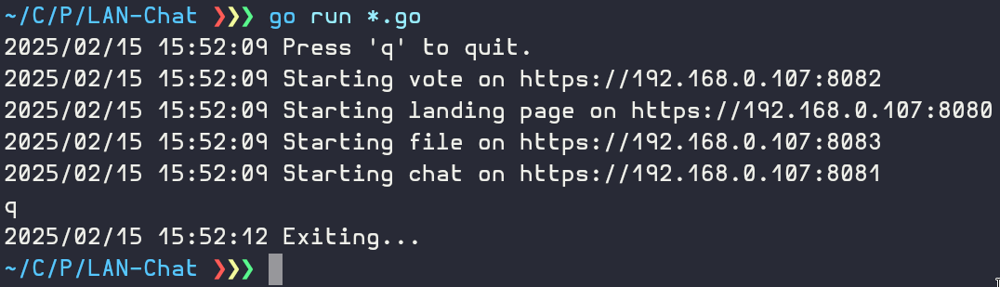

## ⚠️ **Still in development**

You can see the completed features in the **Features** part of the readme.

# LAN chat

An https websocket (aka. wss) chat site served on the computers local IP adress allowing anyone on the local network to connect to it.



Different functionalities are on different ports (ie. chat is on 8081, file sharing on 8082...).

## Features

Currently implemented features:
- [x] Texting
- [ ] Voting
- [ ] File sharing
- [ ] Drawing

## Prerequisites

- [Go](https://go.dev).
- [OpenSSL](https://www.openssl.org/).

## Installation

To get started with this project, clone the repository and run (or compile, then run) using the `go` command.

```bash
git clone https://github.com/ikugo-dev/LAN-chat.git
cd LAN-chat
openssl req -x509 -newkey rsa:4096 -keyout key.pem -out cert.pem -days 365 -nodes
go run *.go
```
or
```bash
go build
./lan-chat
```
to compile it first.

## Usage

The logs will give you a good idea of how the site is structured, but just in case...

The landing/home page contains links to every other port, they are **NOT** on different IPs, so its still just one site that can handle multiple use cases at the same time.

These are the port numbers of every site:

- homePort = "8080"
- chatPort = "8081"
- votePort = "8082"
- filePort = "8083"
- drawPort = "8084"

### ⚠️ **Warning**

You **need** to use https:// to access the site, otherwise it will not show up.

The certificate is generated localy, so it's gonna display some warning when acessing the site for the first time.
